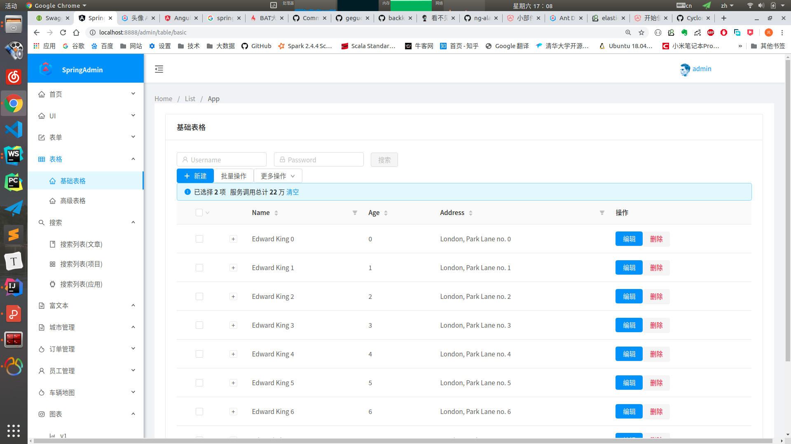

[TOC]

# SpringAdmin

>为大数据实战项目搭建后台简单的管理模块

# 列表页面和详情页面
TODO: 后台API接入和echarts 图表展示

# 截图

#参考

- ng-alian: https://ng-alain.github.io/ng-alain/#/widgets
- angular-js: https://angular.cn/cli/generate#module
- ng-ant-design: https://ng.ant.design/components/avatar/zh
